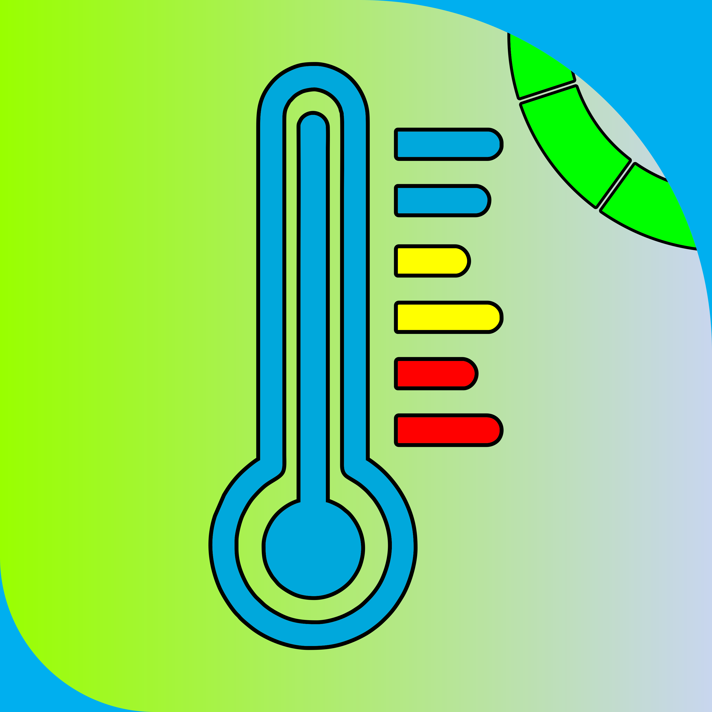

# Cold Space

República Dominicana, un país tropical ubicado en el Caribe, donde el calor puede ser incómodo dependiendo de la estación. En el verano de 2023, me sorprendió ver en los análisis de la NASA que había sido uno de los veranos más calurosos en la Tierra. Quise conocer la temperatura de mi habitación mientras dormía, y ya tenía mi kit de Arduino (Starter Kit Multilanguage). Con muchas ganas, diseñé rápidamente mi circuito con los siguientes componentes para obtener la lectura de la temperatura de mi habitación.

# Componentes
- Arduino Uno R3 (Cerebro)
- x3 Ledes (Azul, Amarillo, Rojo)
- Sensor de Temperatura (TMP36)

> Revisa los folders y subfolders, estan todos los codigos de Arduinos bien documentados, si tienes dudas escribeme por alguna de mis redes.

---

© 2023. Todos los códigos e imágenes dentro de este repositorio han sido creados por mí. Todos los derechos reservados.
